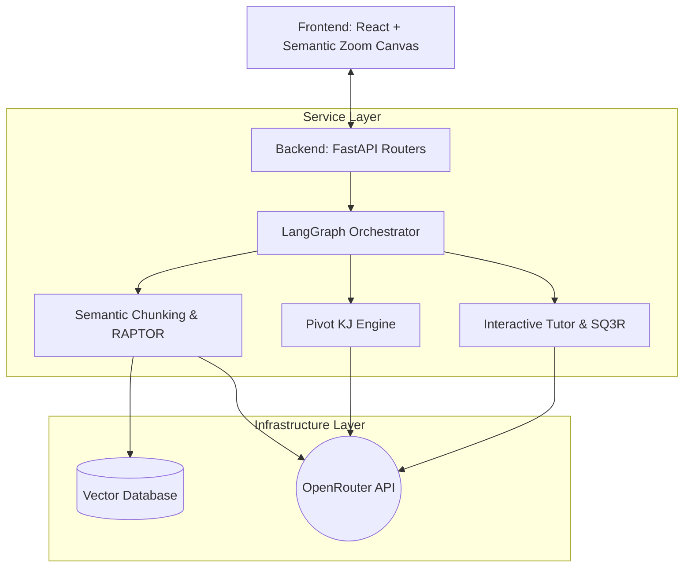

# matome (まとめ)


*Turn information into insight with matome, an active learning knowledge workspace.*

## Overview

### What
**matome** is a revolutionary knowledge workspace designed to transform the painful process of reading and summarising large documents into an engaging, interactive game of intellectual discovery. By integrating cognitive psychology principles (SQ3R method, Feynman technique) with advanced generative AI (RAPTOR, Multi-Dimensional Semantic KJ), matome seamlessly converts overwhelming text into dynamic knowledge networks and actionable insights.

### Why
Information overload stops learning and productivity. Current tools just summarise; they don't help you build knowledge. Matome uses cognitive science and active learning to force you to actively engage with the material. We help prevent the "As-Is trap" by forcing you to extract system requirements and logic instead of just rephrasing text.

### Demo
*Screenshots and demo video coming soon...*

## Features

*   **Robust Configuration:** Centralised environment variable management using Pydantic Settings.
*   **Schema-First Design:** Defined strict data models for Documents, Chunks, and Concept Nodes representing knowledge.
*   **Separation of Concerns:** Abstract interface definitions (Ports) for external systems (LLM Providers, Vector Stores, and File Storage).
*   **Semantic Zoom UI & Progressive Disclosure:** Never drown in a wall of text again. Start with a beautiful, high-level mind map (the "Big Picture") and zoom in seamlessly to read detailed summaries only when you are ready.
*   **Frictionless Active Learning (Micro-Gamification):** Defeat the "Lost-in-the-Middle" phenomenon. The system prevents passive reading by forcing you to answer AI-generated questions before unlocking nodes, turning learning into a rewarding game.
*   **Voice Interactive "Recite" Phase:** Use your voice to explain concepts back to the AI (Feynman Technique). The Context-Aware Hierarchical Merging (CAHM) algorithm checks your understanding against facts and provides gentle "Sandwich Feedback."
*   **Multi-Dimensional Knowledge Restructuring (Pivot KJ):** Break free from the author's narrative. Instantly reorganise massive documents along custom analytical axes (e.g., SWOT, System Actors) to discover novel cross-sectional insights.
*   **Automated Export & Web-Grounding:** With one click, generate comprehensive Product Requirements Documents (PRDs) and valid Mermaid.js UML diagrams from your restructured knowledge boards, grounded in modern best practices.

## Requirements

To run this project, you will need the following tools installed:

*   **Python:** 3.12 or higher
*   **uv:** For extremely fast Python package and project management (see [uv documentation](https://docs.astral.sh/uv/))
*   **OpenRouter API Key:** For accessing LLM models (Bring Your Own Key support).

## Installation

1.  **Clone the repository:**
    ```bash
    git clone <repository_url>
    cd matome2-0
    ```

2.  **Sync Dependencies with uv:**
    The project uses `uv` for dependency management. This command will create a `.venv` and install all required packages.
    ```bash
    uv sync
    ```

3.  **Configure Environment Variables:**
    Create a `.env` file based on `.env.example` (if present) or add your required configuration keys such as your LLM/Vector Store API keys.
    ```bash
    echo "OPENROUTER_API_KEY=your_key_here" >> .env
    echo "PINECONE_API_KEY=your_key_here" >> .env
    ```

## Usage

*(Note: The project is currently under active development. The following commands reflect the intended usage once the API is fully implemented).*

### Quick Start (Interactive Tutorial / UAT)

The easiest way to experience the "Aha! Moment" of matome is to run the User Acceptance Test script which demonstrates the core knowledge extraction and transformation flow.

```bash
uv run pytest tests/uat/test_uat.py -v -s
```

You can also run our interactive visual tutorial powered by Marimo, which brings the "Aha! Moment" right into your browser:

```bash
uv run marimo edit tutorials/UAT_AND_TUTORIAL.py
```

This script acts as our active tutorial, demonstrating the ingestion of simulated documents, answering AI questions to unlock cognitive nodes, and restructuring them via our multi-dimensional Pivot KJ analytical engine.

### Running the API Server

To start the main FastAPI backend server for development:

```bash
uv run uvicorn main:app --reload
```

## Architecture/Structure

matome is built on a high-performance, asynchronous Python backend utilising FastAPI and LangGraph. It strictly adheres to an Onion/Clean Architecture to guarantee separation of concerns and testability.


*For complete architectural details, read the `dev_documents/system_prompts/SYSTEM_ARCHITECTURE.md` file.*

```text
matome2-0/
├── dev_documents/    # System Architecture, PRD, and User Test Scenarios
├── src/              # Core Application Source Code
│   ├── api/          # FastAPI routers and endpoints
│   ├── core/         # Central configuration and security
│   ├── domain/       # Pydantic models and interface ports
│   ├── infrastructure/ # Concrete database and API clients
│   └── services/     # Business logic and LangGraph workflows
├── tests/            # Pytest test suites (Unit, Integration, E2E)
├── tutorials/        # Marimo notebooks for UAT and onboarding
├── pyproject.toml    # Project dependencies and strict linter config
└── main.py           # Application entry point
```

## Roadmap

*   **Foundational Backend**: Schema and backend integration (Vector Store, LLM setup).
*   **Voice Interaction**: Real-time voice interaction and audio transcription endpoints.
*   **Semantic Zooming UI**: User interface construction with Semantic Zooming and React Flow.
*   **Team Collaboration**: Multi-user collaboration capabilities.

## License

This project is licensed under the MIT License - see the [LICENSE](LICENSE) file for details.
