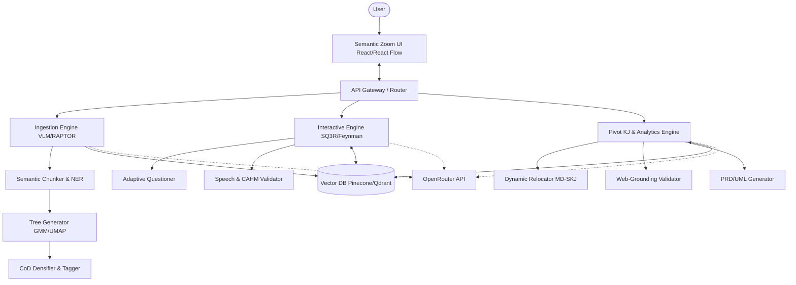

# matome2-0 (まとめ)


"情報の咀嚼という苦痛から人類を解放し、知識の獲得と新たなインサイトの創出を、最高にエキサイティングな知能ゲームへと変容させる。"

`matome2-0` is an ultimate knowledge workspace that seamlessly integrates cognitive psychology (SQ3R, cognitive load theory, Feynman technique, forgetting curve) with cutting-edge Generative AI technologies (RAPTOR, GraphRAG, MD-SKJ) to provide a "frictionless (zero-friction) active learning platform". It is not merely a tool for summarizing long texts, but rather a system designed to build robust "knowledge networks" in the user's brain, supporting the entire pipeline from information ingestion to innovative output generation (e.g., requirement specifications, pitch decks, research outlines).

## Key Features

- **Progressive Disclosure UI (Semantic Zooming)**: Prevents cognitive overload by presenting the big picture first (e.g., an interactive hierarchical tree of concepts) and allowing users to zoom into specific areas of interest.
- **Micro-Gamification for Active Learning (SQ3R Automation)**: Replaces passive reading with interactive, adaptive questioning before unlocking new information, and provides micro-rewards to maintain flow state.
- **Speech-to-Text Recitation (Feynman Method)**: Integrates voice interactions to allow users to explain concepts back to the system, which then uses the Context-Aware Hierarchical Merging (CAHM) algorithm to fact-check and provide constructive feedback.
- **Pivot KJ (Multi-Dimensional Knowledge Re-construction)**: Automatically re-arranges ingested information based on multi-dimensional axes (e.g., business frameworks, system architectures) to generate actionable insights and output formats like PRDs and UML diagrams.
- **Multimodal AI Preprocessing**: Robust pipeline for ingesting complex documents (PDFs with charts, math, images) using Vision-Language Models, semantic chunking, and RAPTOR-based hierarchical tree generation.

## Architecture Overview

`matome2-0` employs a modern, scalable architecture utilizing a robust FastAPI/LangGraph backend and a high-performance React/React Flow frontend, orchestrated around Pydantic domain models for strict type safety and modularity.



## Prerequisites

- **Python 3.12+**
- **uv** (Package manager)
- **OpenRouter API Key** (or standard OpenAI/Anthropic/Gemini API keys)
- Node.js/npm (for frontend, upcoming)

## Installation & Setup

1. **Clone the repository**
   ```bash
   git clone https://github.com/your-org/matome2-0.git
   cd matome2-0
   ```

2. **Initialize the environment**
   Use `uv` to install dependencies and manage the virtual environment:
   ```bash
   uv sync
   ```

3. **Configure Environment Variables**
   Create an `.env` file from the example:
   ```bash
   cp .env.example .env
   ```
   Add your `OPENROUTER_API_KEY` and other necessary configurations.

## Usage

**Quick Start**

Currently in the architectural setup phase. To run the baseline verification and interactive tutorials, you will use Marimo.

```bash
uv run marimo edit tutorials/UAT_AND_TUTORIAL.py
```

## Development Workflow

This project enforces strict code quality standards utilizing `ruff`, `mypy` (strict), and `pytest`. It is structured around an 8-cycle implementation methodology.

- **Run Linters:**
  ```bash
  uv run ruff check
  ```
- **Run Type Checking:**
  ```bash
  uv run mypy src dev_src main.py
  ```
- **Run Tests:**
  ```bash
  uv run pytest
  ```

## Project Structure

```
matome2-0/
├── dev_documents/
│   ├── system_prompts/   # CYCLE-based architecture and implementation details
│   ├── ALL_SPEC.md       # Raw requirements
│   └── USER_TEST_SCENARIO.md # Master plan for tutorials and testing
├── src/                  # Core source code (to be populated)
├── tests/                # Test suite
├── tutorials/            # Marimo tutorial files
├── pyproject.toml        # Project configuration
└── README.md             # Project landing page
```

## License

MIT License
