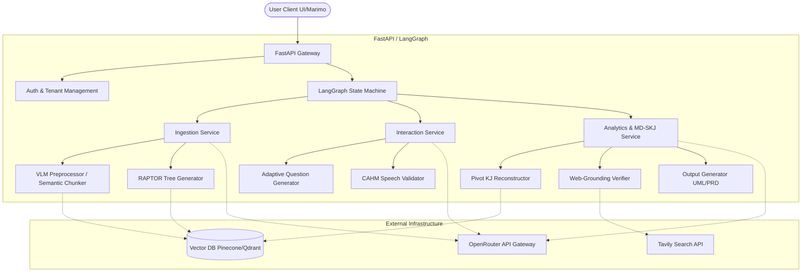

# SYSTEM_ARCHITECTURE.md

## 1. Summary
matome2-0 is a revolutionary knowledge workspace designed to transform the painful process of information ingestion and comprehension into a frictionless, micro-gamified intellectual pursuit. By integrating established cognitive psychology methodologies—such as the SQ3R active reading method, Cognitive Load Theory, the Feynman Technique for recitation, and the Ebbinghaus forgetting curve for spaced repetition—with state-of-the-art Generative AI capabilities including RAPTOR (Recursive Abstractive Processing for Tree-Organized Retrieval), GraphRAG, and MD-SKJ (Multi-Dimensional Semantic KJ method), matome2-0 empowers users to rapidly internalize complex, unstructured documents. It does not merely summarize text; it builds a robust, queryable knowledge network directly aligned with the user's specific learning or business objectives. The system ingests various document formats, automatically extracts underlying semantic chunks and entities using Vision-Language Models (VLMs), and structures them into a hierarchical, easily navigable tree. This tree is presented via a Semantic Zoom Progressive Disclosure UI that minimizes cognitive overload by revealing details only when the user requests them, often gated by adaptive questioning to enforce active recall. Finally, the platform's 'Pivot KJ' capability allows users to dynamically reconstruct these knowledge graphs along new, multi-dimensional axes—such as SWOT analysis or system architecture views—facilitating the instantaneous generation of actionable insights, requirements documents, and complex UML diagrams.

## 2. System Design Objectives
The architecture of matome2-0 is driven by a set of uncompromising design objectives aimed at ensuring exceptional performance, unparalleled user experience, and rigorous data integrity, all while managing the inherent unpredictability and latency of Large Language Models (LLMs).

First and foremost is **Frictionless Ingestion**. The system must seamlessly accept a wide array of document formats, including text-heavy PDFs, EPUBs, Markdown files, and web URLs. Crucially, it must intelligently handle multimodal elements such as embedded charts, graphs, and mathematical equations. This is achieved by employing advanced Vision-Language Models (VLMs) during the preprocessing phase, which extract not only the raw text but also the contextual meaning and visual relationships present in the original document, normalizing them into a structured, semantic Markdown format.

The second core objective is **Cognitive Load Minimization**. Recognizing that human working memory is severely limited, the backend architecture is heavily optimized to support the Progressive Disclosure UI (Semantic Zooming). The system pre-calculates highly condensed, information-dense summaries for every node in the knowledge tree using a Chain of Density (CoD) prompting strategy. Furthermore, the hierarchical tree itself is constructed using sophisticated clustering algorithms (UMAP and Gaussian Mixture Models) within the RAPTOR framework, ensuring that the frontend only ever needs to load and display the conceptually relevant layer of information, preventing the user from being overwhelmed by a "wall of text."

The third objective is the establishment of a **Frictionless Gamification Loop**. The architecture must support ultra-low latency interactions to maintain the user's state of flow. This requires stateful management of user progress, including tracking which nodes are locked, which have been reviewed, and scheduling future reviews based on spaced repetition algorithms. The interaction engine dynamically generates adaptive questions (SQ3R) based on the user's proficiency and the hidden content of the locked nodes, enforcing active retrieval without causing frustration. The audio recitation phase (Feynman method) demands near-real-time speech-to-text processing and subsequent fact-checking via the Context-Aware Hierarchical Merging (CAHM) algorithm.

Fourth, the system must enable **Multi-Dimensional Insight Generation (MD-SKJ)**. The true power of matome2-0 lies in its ability to dynamically recalculate and restructure the knowledge graph based on user-defined or pre-set analytical axes (e.g., business frameworks like PESTLE, or software design axes like Actor-State). This requires a highly optimized integration with a Vector Database (such as Pinecone or Qdrant) that supports rapid, metadata-filtered hybrid search, allowing the system to instantly query and reassemble semantic chunks across thousands of documents.

Finally, the architecture demands **Robust AI Orchestration and Modularity**. The system relies on LangGraph to manage complex, multi-step LLM workflows (like Web-Grounding and self-correction loops) as resilient state machines, ensuring fault tolerance and the ability to resume long-running processes. The system adheres strictly to Domain-Driven Design principles, utilizing Pydantic V2 models to enforce strict typing and separation of concerns across the API, Service, and Infrastructure layers. This prevents the emergence of "God Classes," ensures high testability through dependency injection, and allows for the easy swapping of external service providers (e.g., routing between different models via OpenRouter based on cost and capability requirements).

## 3. System Architecture
The matome2-0 architecture is a modern, modular, API-first design built upon the FastAPI framework, orchestrated by LangGraph, and backed by a high-performance Vector Database. The architecture strictly enforces boundaries between components to guarantee maintainability and scalability.



The system is fundamentally divided into four distinct layers. The **API Layer** acts as the ingress point, responsible strictly for HTTP request routing, authentication, and payload validation using Pydantic schemas. It contains absolutely no business logic, acting merely as a traffic cop. The **Orchestration Layer**, powered by LangGraph, manages the state transitions for complex operations. For instance, when a document is uploaded, LangGraph dictates the sequence: VLM Parsing -> Chunking -> Clustering -> Tree Generation -> Tagging, handling retries if an LLM call fails midway.

The **Service Layer** houses the core domain logic, separated into discrete domains: `Ingestion` (handling parsing and chunking), `Interaction` (managing the SQ3R QA loop and audio recitation), and `Analytics` (driving the Pivot KJ engine and Web-Grounding). These services are composed of pure functions and stateless classes wherever possible, making them highly testable. Crucially, they do not directly interact with external APIs or databases. Instead, they rely on the **Infrastructure Layer**, which provides concrete implementations of abstract interfaces (e.g., an `ILLMProvider` interface wrapping OpenRouter, or an `IVectorStore` interface wrapping Pinecone). This rigorous separation of concerns ensures that the core AI reasoning logic remains insulated from the volatility of external vendor SDKs, allowing developers to swap out underlying technologies without rewriting the business rules.

## 4. Design Architecture
The data design of matome2-0 is heavily anchored in strict typing and validation provided by Pydantic V2. By enforcing constraints at the model level, we ensure that illegal states are unrepresentable throughout the system. This additive mindset requires that new features build upon existing domain objects rather than replacing them.

```ascii
matome2-0/
├── src/
│   ├── api/
│   │   ├── routers/
│   │   └── dependencies.py
│   ├── core/
│   │   ├── models/
│   │   │   ├── document.py
│   │   │   ├── chunk.py
│   │   │   ├── node.py
│   │   │   ├── interaction_state.py
│   │   │   └── pivot_graph.py
│   │   ├── config.py
│   │   └── exceptions.py
│   ├── services/
│   ├── infrastructure/
│   └── workflows/
├── tests/
└── pyproject.toml
```

At the foundation is the `SemanticChunk` model, which represents the smallest indivisible unit of meaning extracted from a document. Unlike traditional fixed-length chunks, these are determined by cosine similarity drop-offs (semantic boundaries). The `SemanticChunk` model is additive; it starts with raw text and vector embeddings, and is progressively enriched by background processes with extracted `Entities` (Named Entity Recognition) and `MultiDimensionalTags` (labeling the chunk along axes like Time, Logic, Polarity, and System Design).

Above the chunks sits the `KnowledgeNode` model, the core building block of the RAPTOR hierarchical tree and the Semantic Zoom UI. A `KnowledgeNode` contains a highly condensed `dense_summary` (generated via the Chain of Density process) and recursively references its child `KnowledgeNode` IDs, creating a navigable tree structure. It also maintains references to the underlying `SemanticChunk` IDs that inform its summary, ensuring complete traceability back to the original text.

The `Document` model aggregates the root `KnowledgeNode` and holds document-level metadata (author, source, ingestion status). To handle the user's progress through the gamified learning loop, we introduce the `InteractionState` model. This stateful object tracks the locking mechanism for each node on a per-user basis, manages the currently active adaptive question, and records the spaced repetition schedule (e.g., when a node should be reviewed next based on the FSRS algorithm).

Finally, the `PivotGraph` model represents a dynamically generated, ephemeral view of the knowledge. When a user executes a Pivot KJ operation, the system queries the Vector DB based on the pre-calculated `MultiDimensionalTags` and constructs a new graph structure. The `PivotGraph` does not duplicate the underlying `KnowledgeNode` or `SemanticChunk` data; it simply holds the structural relationships and new cluster assignments dictated by the chosen analytical axis (e.g., SWOT). This ensures the system remains highly performant and memory-efficient even when recalculating massive knowledge networks.

## 5. Implementation Plan
The implementation of the matome2-0 architecture is divided into eight discrete, sequential development cycles. Each cycle delivers a testable, independently verifiable slice of functionality, gradually building up the complex AI pipelines.

1. **CYCLE01: Core Pydantic Models & API Routing Base Setup.** This cycle establishes the foundational schemas (`Document`, `SemanticChunk`, `KnowledgeNode`), the FastAPI application shell, the dependency injection container, and the abstract interfaces for the LLM and Vector DB infrastructure. The goal is to ensure absolute type safety and framework stability before introducing complex AI logic.
2. **CYCLE02: Document Ingestion & Multimodal Preprocessing (VLM).** We implement the pipeline to ingest raw files, utilizing Vision-Language Models via OpenRouter to parse complex PDFs (including charts and math) into clean, semantic Markdown, while simultaneously stripping out noise like headers and footers using heuristic cleaners.
3. **CYCLE03: Semantic Chunking & Entity Extraction.** We replace rudimentary fixed-length splitting with an advanced semantic chunker that analyzes vector cosine similarity to split text at natural contextual boundaries. Concurrently, we implement the NER extractor to identify key actors and concepts, saving the enriched `SemanticChunks` to the Vector DB.
4. **CYCLE04: RAPTOR Hierarchical Tree Generation.** We build the core of the knowledge structuring engine, implementing UMAP dimensionality reduction and Gaussian Mixture Model (GMM) soft clustering to group related chunks. We then construct the recursive RAPTOR algorithm to build the hierarchical `KnowledgeNode` tree from the bottom up.
5. **CYCLE05: Information Densification (CoD) & Tagging.** We implement the iterative Chain of Density prompting loop to create maximally dense summaries for the `KnowledgeNodes`. Additionally, we deploy background taggers to label every chunk with multi-dimensional metadata (Time, Logic, Polarity, SystemDesign) in preparation for future Pivot operations.
6. **CYCLE06: Semantic Zoom UI Backend & Question Generation.** We focus on the interactive SQ3R loop, implementing the `InteractionState` to manage node locks and progression. We develop the prompt engineering required to dynamically generate adaptive questions (Fact, Inference, Application) based on the hidden content of locked nodes.
7. **CYCLE07: Recite Phase & Speech Feedback Loop (CAHM).** We integrate the audio ingestion pipeline (simulating Whisper/Web Speech) and implement the highly complex Context-Aware Hierarchical Merging (CAHM) algorithm. This cross-references the user's spoken recitation against the ground-truth chunks in the Vector DB to detect hallucinations and provide constructive, "sandwich-style" feedback.
8. **CYCLE08: Pivot KJ, Web-Grounding & Output Export.** The final cycle implements the MD-SKJ engine, allowing users to dynamically reconstruct the graph based on custom axes (e.g., SWOT). We integrate Tavily for Web-Grounding to validate AI suggestions against real-time data, and finally, build the export engine to translate the `PivotGraph` into Markdown PRDs and Mermaid.js UML code.

## 6. Test Strategy
Testing a system reliant on non-deterministic LLMs requires a rigorous, multi-layered approach to guarantee stability, prevent regressions, and control API costs. The testing strategy is strictly divided into unit testing for isolated logic and integration testing for workflow validation, with a strict mandate to avoid side-effects (e.g., actual billing against OpenRouter during routine CI runs).

For **CYCLE01 through CYCLE08**, the Unit Testing approach will mandate near 100% coverage on all Pydantic models in `src/core/models`. Every custom validator must be tested with both positive and negative boundary conditions to ensure illegal states are rejected. For the service layer logic, we will aggressively employ mocking. For instance, when testing the `semantic_chunker.py`, we will provide a hardcoded list of synthetic sentence embeddings rather than calling an actual embedding model, asserting that the chunking algorithm correctly identifies the similarity drop-offs. When testing the RAPTOR tree builder, we will mock the GMM clustering output to verify the recursive node construction logic in isolation. This isolation ensures tests run in milliseconds and provides deterministic feedback to developers. We will utilize parameterized testing in `pytest` to evaluate prompt formatting functions against a wide array of edge-case inputs without requiring live LLM inference.

The Integration Testing strategy focuses on verifying the flow of data across architectural boundaries and through the LangGraph state machines. To prevent side-effects, we will utilize tools like `responses` or `pytest-httpx` to intercept outgoing HTTP calls to OpenRouter and Tavily, injecting pre-recorded JSON responses (cassettes). For Vector DB interactions, we will utilize an in-memory test double or a locally containerized instance of Qdrant/Pinecone-mock. A critical integration test for CYCLE02, for example, will involve submitting a dummy PDF to the FastAPI endpoint, intercepting the mocked VLM response, and verifying that the final `IngestionJob` state correctly transitions to completed. For the complex LangGraph workflows in CYCLE04 and CYCLE08, we will execute the entire state machine using mocked LLM outputs, verifying that the orchestrator correctly handles potential failure states, executes the required fallback logic, and ultimately produces a correctly formatted `PivotGraph` or `KnowledgeNode` tree that successfully passes Pydantic validation before being returned via the API.
